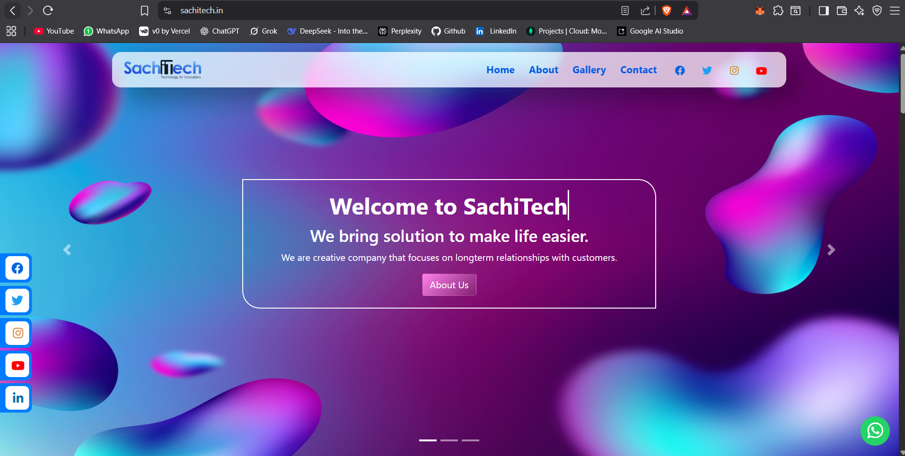

# 🌐 Sachitech Website Project  

This is the official website of **Sachitech Training Institute**, developed during my internship.  
The site is **live and hosted** till date, showcasing the institute’s training programs, contact information, and services.  

🔗 **Live Website:** [Visit Here](https://www.sachitech.com)  
📂 **Repository:** [GitHub Link](https://github.com/yourusername/Sachitech-website-project)  

---

## 🛠️ Tech Stack

<p align="left">
  
  
  
  
</p>

---

## ✨ Features
✅ Responsive design for desktop and mobile  
✅ Home, About, Courses, and Contact sections  
✅ Interactive UI components using JavaScript & Bootstrap  
✅ Easy navigation and clean design  

---

## 📸 Screenshots
  
*(Add more screenshots for About/Courses/Contact pages if possible)*  

---

## 🚀 Getting Started (Run Locally)

1. Clone the repository:
   ```bash
   git clone https://github.com/yourusername/Sachitech-website-project.git
